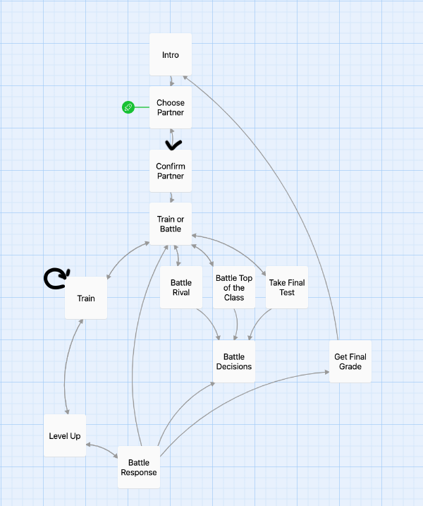
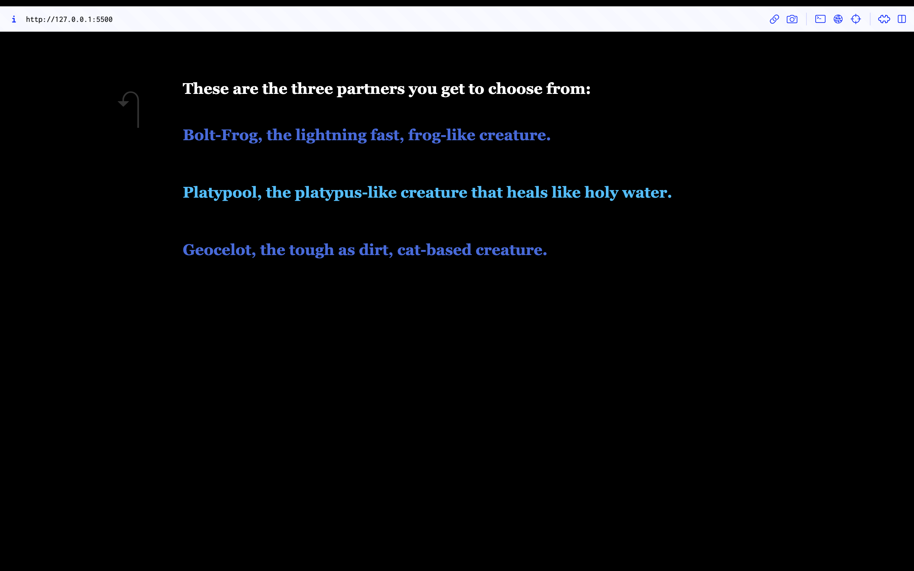
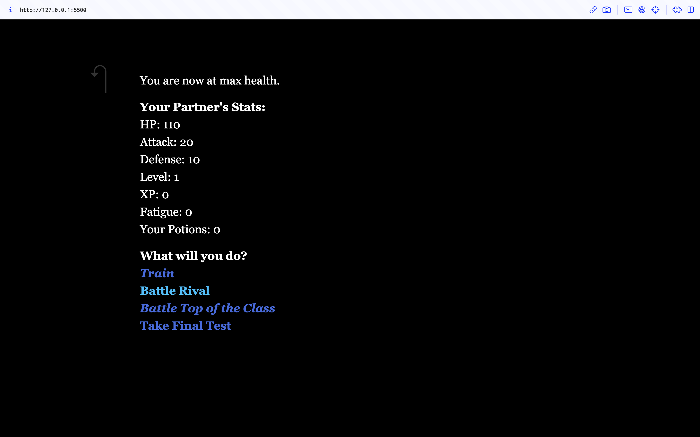

# Finite State Game

This project contains a finite state game called _Intro to AI Training_. This project was an exercise for designing and managing game state for my _Introduction to 3D Game Graphics_ class at IUPUI. The game was created with _[Twine](https://twinery.org/)_, a tool for creating interactive, nonlinear stories. Game state is managed through a graph-like system where each node is a passage in the story. Each passage has static variables for storing game state that changes based on player choices and moving to other nodes. The graph for how the story is structured can be seen in the image below:

## Running the Game
The game can be played by hosting the index.html page on a local server. The html file should already have all css and scipts needed to play the game.

## How to Play
_Intro to AI Training_ is a choose-your-own-adventure game that is played through interactive links found in passages. Clicking on a link will progress the story and state of the game by moving to a new passage and updating static variables. Gameplay is similar to Pokemon where you get to choose a partner creature and train them through battle. In this game, you can battle your rival who is easy, but gives you less experience, or you can battle the student at the top of the class who is more difficult, but gives you more experience. Once you feel you are strong enough, you can take your final test to show your professor your battling skills.

